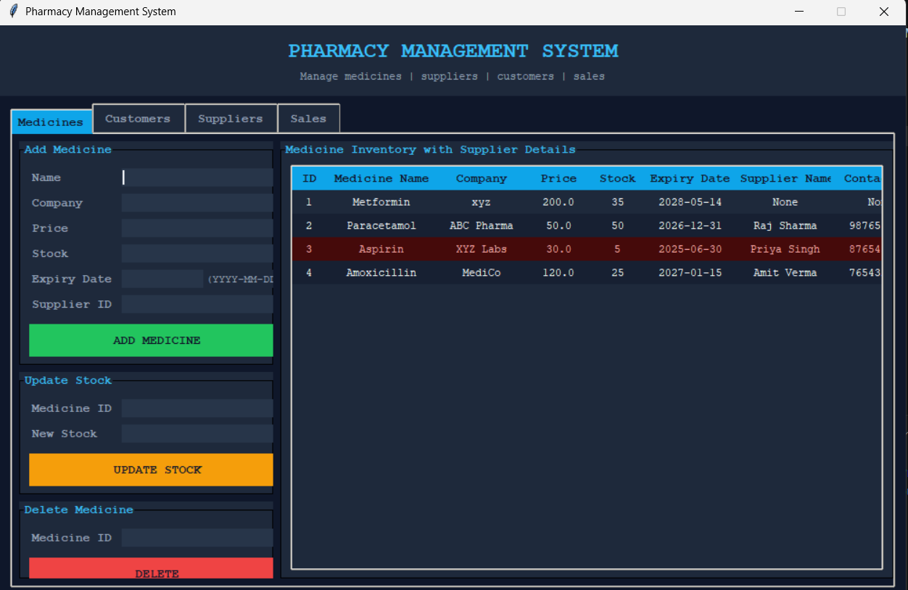
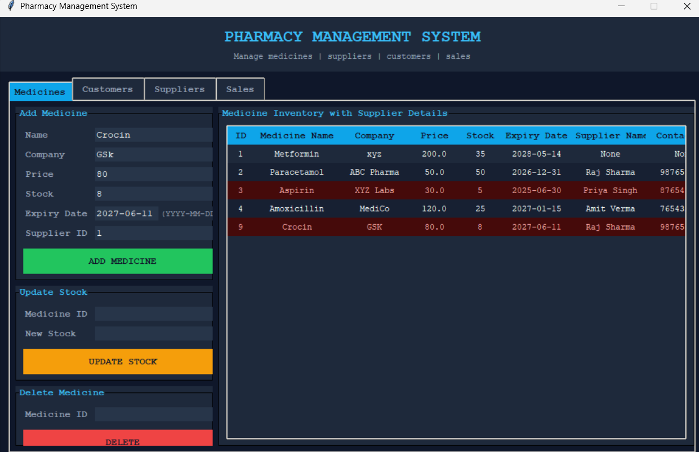
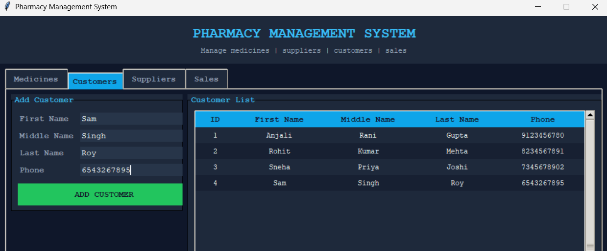
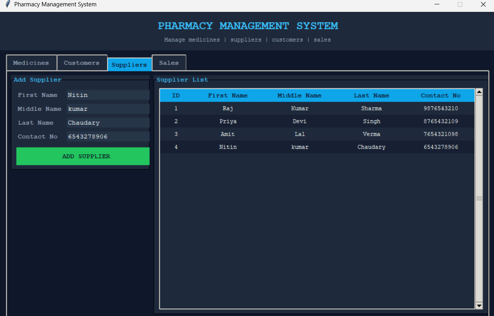
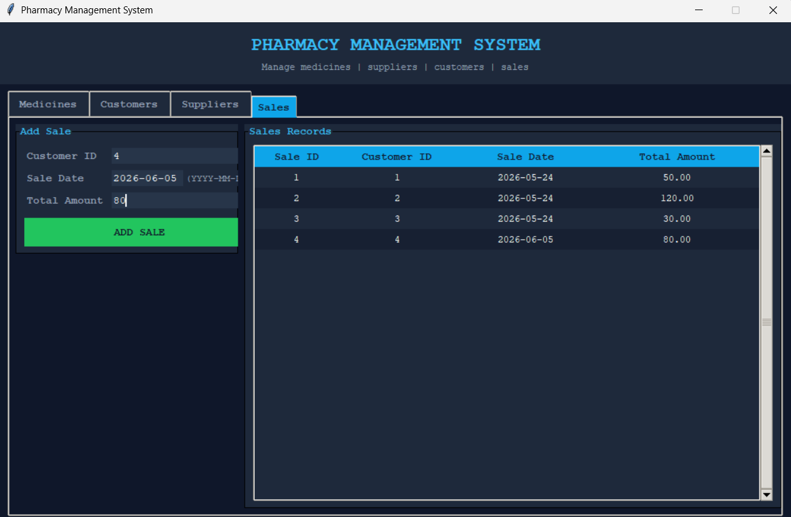

# Pharmacy-Management-System
A Pharmacy Management System developed using Python and MySQL for efficient medicine inventory and customer management.

## Features

- Add, update and delete medicines
- Manage customers
- Manage suppliers
- Record sales

##  How to Run

1. Clone the repository.
2. Install the required package:
   ```bash
   pip install mysql-connector-python
   ```
3. Create the database using `queries.sql`.
4. Update the MySQL username and password in `pharmacy.py` (or enter the password when prompted).
5. Run:
   ```bash
   python pharmacy.py
   ```

## Application Screenshots

### Dashboard


### Medicine Management


### Customer Management


### Supplier Management


### Sales Management

